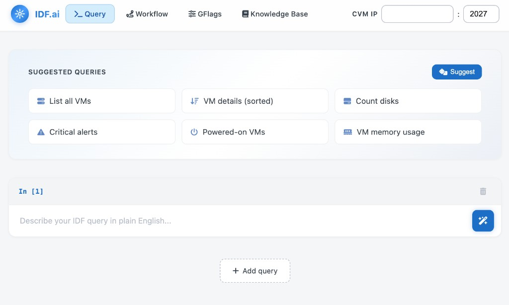
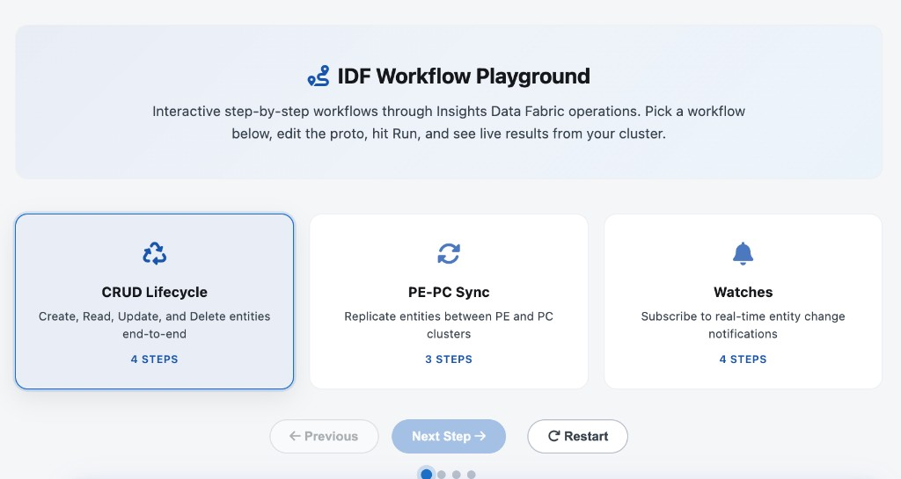
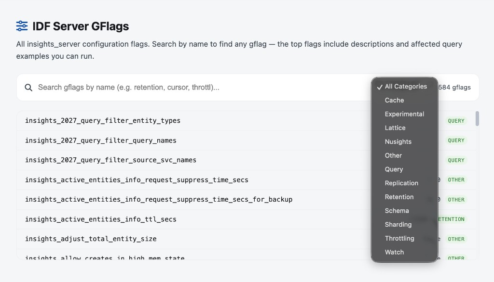
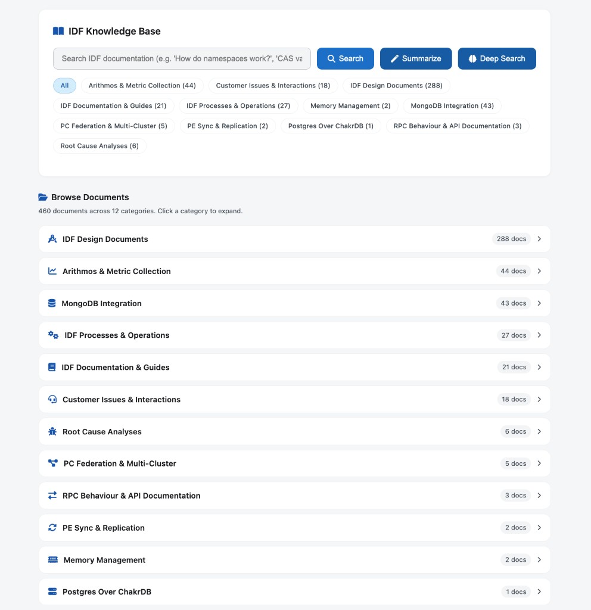

# IDF.ai

**AI-Powered Insights Data Fabric Query & Onboarding Tool**

IDF.ai is an internal tool designed to simplify how engineering teams understand, query, and onboard onto the Insights Data Fabric (IDF) platform. It provides natural language query generation, interactive workflow playgrounds, a searchable GFlags catalog, and a comprehensive knowledge base — all powered by a fine-tuned local LLM.

<p align="center">
  
</p>

---

## Table of Contents

- [Motivation](#motivation)
- [Models Used](#models-used)
- [Architecture](#architecture)
- [Fine-Tuning Pipeline](#fine-tuning-pipeline)
- [Features](#features)
  - [Query Tab](#1-query-tab)
  - [Workflow Tab](#2-workflow-tab)
  - [GFlags Tab](#3-gflags-tab)
  - [Knowledge Base Tab](#4-knowledge-base-tab)
- [Tech Stack](#tech-stack)
- [Project Structure](#project-structure)
- [Setup & Running](#setup--running)
- [Training Data](#training-data)
- [Future Work](#future-work)

---

## Motivation

IDF (Insights Data Fabric) is a core infrastructure component used across Nutanix services for entity storage, metrics collection, and real-time event subscriptions. However, its protobuf-based query interface, extensive configuration options (584+ gflags), and complex RPC semantics create a steep learning curve for teams integrating with it.

**IDF.ai addresses this by providing:**

- Natural language → IDF proto query generation
- Interactive step-by-step workflow playgrounds with live cluster execution
- A searchable, categorized knowledge base built from 12+ internal documentation packages
- A comprehensive GFlags catalog with descriptions and affected query examples

---

## Models Used


| Model                                      | Purpose                                                                         | Details                                                                        |
| ------------------------------------------ | ------------------------------------------------------------------------------- | ------------------------------------------------------------------------------ |
| **Microsoft Phi-4 (14B, 4-bit quantized)** | LLM for query generation, intent classification, summarization, and deep search | Fine-tuned with LoRA on 2000+ validated IDF query examples using MLX framework |
| **nomic-embed-text**                       | Text embeddings for semantic search                                             | Run locally via Ollama for knowledge base indexing and retrieval               |


### Why Phi-4?

- Strong reasoning capabilities for complex proto generation
- 14B parameter model runs efficiently on Apple Silicon (4-bit quantization via MLX)
- Excellent instruction-following after LoRA fine-tuning
- Supports long context windows needed for multi-attribute query generation

---

## Architecture

```
┌─────────────────────────────────────────────────────────────┐
│                        IDF.ai WebApp                         │
│                    (Single-Page Application)                  │
│  ┌─────────┐ ┌──────────┐ ┌────────┐ ┌────────────────┐   │
│  │  Query  │ │ Workflow  │ │ GFlags │ │ Knowledge Base │   │
│  └────┬────┘ └─────┬────┘ └───┬────┘ └───────┬────────┘   │
└───────┼─────────────┼──────────┼──────────────┼─────────────┘
        │             │          │              │
        ▼             ▼          ▼              ▼
┌─────────────────────────────────────────────────────────────┐
│                    UI Backend (FastAPI :3001)                 │
│  • Proxies requests to main backend                          │
│  • Executes protos on CVM via SSH + idf_cli.py              │
│  • Handles Watch/Sync RPCs via InsightsInterface             │
└──────────────────────────┬──────────────────────────────────┘
                           │
                           ▼
┌─────────────────────────────────────────────────────────────┐
│                  Main Backend (FastAPI :8000)                 │
│  ┌──────────────┐  ┌──────────────┐  ┌──────────────────┐  │
│  │ LLM Client   │  │Query Executor│  │ Knowledge Base   │  │
│  │ (Phi-4 MLX)  │  │ (SSH→CVM)    │  │ Service          │  │
│  └──────┬───────┘  └──────┬───────┘  └────────┬─────────┘  │
│         │                  │                   │             │
│         ▼                  │                   ▼             │
│  ┌──────────────┐          │          ┌──────────────────┐  │
│  │ MLX Server   │          │          │ ChromaDB         │  │
│  │ (Phi-4 Fused)│          │          │ (Vector Store)   │  │
│  │ :8090        │          │          │ + nomic-embed    │  │
│  └──────────────┘          │          └──────────────────┘  │
│                            │                                 │
└────────────────────────────┼─────────────────────────────────┘
                             │ SSH
                             ▼
┌─────────────────────────────────────────────────────────────┐
│              Nutanix Cluster (CVM)                            │
│  ┌─────────────────┐  ┌──────────────────────────────────┐  │
│  │  idf_cli.py     │  │  InsightsInterface (Python RPC)  │  │
│  │  (CRUD, Query)  │  │  (Watch, Sync, Register)         │  │
│  └─────────────────┘  └──────────────────────────────────┘  │
│                                                              │
│              IDF Server (Insights RPC Service :2027)          │
└─────────────────────────────────────────────────────────────┘
```

### Request Flow

1. **Query Generation**: User enters natural language → LLM classifies intent → Generates IDF proto → Executes on CVM via SSH → Returns results
2. **Workflow Execution**: User edits proto in playground → Backend executes via `idf_cli.py` (CRUD) or `InsightsInterface` (Watch/Sync RPCs) → Returns live results
3. **Knowledge Search**: User query → nomic-embed-text generates embeddings → ChromaDB vector search + BM25 keyword search → Reciprocal Rank Fusion → Results (or Deep Search with Phi-4 synthesis)

---

## Fine-Tuning Pipeline

```
┌───────────────────┐     ┌───────────────────┐     ┌────────────────────┐
│  Data Generation  │────▶│    Validation     │────▶│   MLX Fine-Tune    │
│                   │     │                   │     │                    │
│ • nutest tests    │     │ • Execute on CVM  │     │ • LoRA (rank 16)   │
│ • Schema parsing  │     │ • Verify output   │     │ • 2081 examples    │
│ • Manual curation │     │ • Filter errors   │     │ • 4-bit quantized  │
│ • AI generation   │     │ • Deduplication   │     │ • Apple Silicon    │
└───────────────────┘     └───────────────────┘     └────────┬───────────┘
                                                             │
                                                             ▼
                                                    ┌────────────────────┐
                                                    │   Fused Model      │
                                                    │                    │
                                                    │ • Adapter merged   │
                                                    │ • Served via MLX   │
                                                    │ • Port 8090        │
                                                    └────────────────────┘
```

### Training Data Composition


| Category                          | Count     | Source                             |
| --------------------------------- | --------- | ---------------------------------- |
| GetEntitiesWithMetrics queries    | ~800      | nutest tests, manual curation      |
| UpdateEntity / DeleteEntity       | ~400      | Lifecycle patterns, AI-generated   |
| Watch API patterns                | ~200      | Watch scenarios, composite watches |
| RegisterEntityTypes / Metrics     | ~150      | Schema registration patterns       |
| Complex filters (WHERE, GROUP BY) | ~300      | Real production query patterns     |
| Edge cases & error handling       | ~150      | Validation failures, corrections   |
| **Total**                         | **~2081** | Validated against live cluster     |


### Fine-Tuning Configuration

- **Base Model**: Microsoft Phi-4 (14B parameters, 4-bit quantized)
- **Framework**: MLX (Apple Silicon optimized)
- **Method**: LoRA (Low-Rank Adaptation)
- **LoRA Rank**: 16
- **Training Format**: Chat-style JSONL (system/user/assistant messages)
- **Validation**: Every generated example executed on a live IDF cluster before inclusion

---

## Features

### 1. Query Tab

<p align="center">
  
</p>

The primary interface for natural language to IDF query conversion.

**Capabilities:**

- Natural language input → IDF protobuf query generation
- Intent classification (read, write, delete, watch, aggregate)
- Live execution against connected CVM cluster
- Configurable CVM IP and port
- Syntax-highlighted proto output
- Error explanation and query suggestions

**How it works:**

1. User types a natural language query (e.g., "Get all VMs with more than 4 vCPUs")
2. Phi-4 classifies the intent and determines the appropriate RPC
3. LLM generates the complete protobuf query
4. Query is executed on the target CVM via SSH
5. Results are displayed with formatting

---

### 2. Workflow Tab

<p align="center">
  
</p>

Interactive step-by-step playgrounds that guide users through complete IDF operation lifecycles.

**Three Workflow Playgrounds:**

#### CRUD Lifecycle (4 steps)

End-to-end entity management:

1. **Create** — Register a VM entity using `UpdateEntity`
2. **Read** — Query the entity with `GetEntitiesWithMetrics`
3. **Update** — Modify attributes on the existing entity
4. **Delete** — Remove the entity with `DeleteEntity`

#### PE-PC Sync (3 steps)

Entity replication between Prism Element and Prism Central:

1. **Register Entity Type** — Configure schema with `suppress_replication: false` and register attributes via `RegisterEntityTypes` + `RegisterMetricTypes`
2. **Write Entity** — Create entity data using `UpdateEntity` (auto-replicates when sync is enabled)
3. **Verify** — Confirm entity exists with `GetEntitiesWithMetrics`

#### Watches (4 steps)

Real-time entity change notification subscription:

1. **Register Watch Client** — Establish a session with `RegisterWatchClient`
2. **Register Watch** — Subscribe to VM creation events with `RegisterWatch`
3. **Poll Fired Watches** — Long-poll for changes with `GetFiredWatchList`
4. **Unregister** — Clean up the session with `UnregisterWatchClient`

**Workflow Features:**

- Editable proto editors with syntax highlighting
- Highlighted editable values (strings, numbers, booleans) in gold
- Step-by-step progression (next step unlocks after running current)
- Live execution against cluster with real RPC responses
- "Continue" navigation between steps
- Detailed explanations of what to edit and why

---

### 3. GFlags Tab

<p align="center">
  
</p>

A searchable catalog of all IDF server-side configuration flags scraped from the live cluster.

**Capabilities:**

- Full-text search across flag names and descriptions
- Category filtering (Query, Cache, Replication, Watch, Storage, etc.)
- Detailed info cards for each flag showing:
  - Flag name and current value
  - Description of what it controls
  - Affected query proto example (executable)
- Direct execution of affected query examples

---

### 4. Knowledge Base Tab

<p align="center">
  
</p>

A comprehensive documentation hub with intelligent search and AI-powered summarization.

**Document Categories (12 packages indexed):**

- Arithmos
- Customer Interactions
- Design Docs
- Documentation
- Memory Management
- MongoDB Integration
- PC Federation
- PE Sync
- Postgres Over ChakrDB
- Process Docs
- RCAs (Root Cause Analyses)
- RPC Behaviours Documentation

**Search Modes:**

#### Standard Search

- Hybrid retrieval: Vector similarity (nomic-embed-text) + BM25 keyword matching
- Reciprocal Rank Fusion for result ranking
- Entity-aware reranking
- Source attribution with document links

#### Summarize

- Retrieves top relevant chunks
- Phi-4 synthesizes a comprehensive answer with citations
- Anti-hallucination guardrails in prompt engineering

#### Deep Search

A 6-stage RAG (Retrieval-Augmented Generation) pipeline for thorough answers:

1. **Query Expansion** — Phi-4 generates multiple search angles/sub-queries
2. **Multi-Pass Retrieval** — Embedding search for each sub-query
3. **Deduplicate & Re-rank** — Merge results, RRF, cross-query boosting
4. **LLM Relevance Filter** — Phi-4 scores and filters chunks for relevance
5. **Iterative Synthesis** — Phi-4 generates comprehensive answer with structured output
6. **Self-Verification** — Phi-4 checks for hallucinations against source material

**Browse Documents:**

- Categorized document browser with collapsible sections
- Document preview with intelligent formatting (headings, code blocks, bullet points)
- Category icons and document count badges

---

## Tech Stack


| Layer           | Technology                                     |
| --------------- | ---------------------------------------------- |
| Frontend        | Vanilla HTML/CSS/JS (single-page app)          |
| UI Backend      | Python FastAPI (port 3001)                     |
| Main Backend    | Python FastAPI (port 8000)                     |
| LLM Inference   | MLX Server (Microsoft Phi-4, port 8090)        |
| Embeddings      | Ollama + nomic-embed-text (port 11434)         |
| Vector Database | ChromaDB (persistent, local)                   |
| RPC Execution   | SSH → CVM (`idf_cli.py` + `InsightsInterface`) |
| Fine-Tuning     | MLX LoRA                                       |
| Model Format    | 4-bit quantized safetensors                    |


---

## Project Structure

```
llm-based-mcp/
├── README.md                          # This file
├── config.py                          # Top-level configuration
├── requirements.txt                   # Python dependencies
├── docker-compose.yml                 # Docker deployment config
├── Dockerfile                         # Container image definition
│
├── backend-server/                    # Main backend service
│   ├── server.py                      # FastAPI app (port 8000)
│   ├── config.py                      # LLM/embedding configuration
│   ├── query_executor.py              # SSH-based query execution on CVM
│   ├── query_classifier.py            # Intent classification
│   ├── proto_response_generator.py    # Proto generation from NL
│   ├── llm_client.py                  # LLM interaction layer
│   ├── embeddings_client.py           # Embedding generation
│   ├── vectordb.py                    # ChromaDB vector store
│   ├── knowledge_base/
│   │   ├── kb_service.py              # Search, summarize, deep search
│   │   ├── kb_indexer.py              # Document ingestion & chunking
│   │   ├── raw_docs/                  # Source documents (12 categories)
│   │   ├── chroma_db/                 # Persistent vector store
│   │   └── doc_index.json             # Document metadata index
│   ├── mlx_grpo_data/
│   │   ├── train.jsonl                # Training data (2081 examples)
│   │   └── valid.jsonl                # Validation data
│   ├── phi4_idf_adapter_final/        # LoRA adapter weights
│   ├── phi4_idf_fused/                # Merged model (ready to serve)
│   ├── nutest_extracted_queries.md    # Extracted test patterns
│   └── idf_schema_reference.md        # Schema documentation
│
├── idf_query_ui/                      # Web application
│   ├── frontend/
│   │   ├── index.html                 # Single-page app (all tabs)
│   │   ├── server_gflags_catalog.json # 584 GFlags scraped from cluster
│   │   └── gflags_catalog.json        # Query-level flags
│   ├── backend/
│   │   └── app.py                     # UI backend (port 3001)
│   ├── start.sh                       # Start all services
│   └── stop.sh                        # Stop all services
│
├── knowledge/                         # Schema & rule files
│   └── schema/                        # Proto definitions
│
├── scripts/                           # Utility scripts
│   └── scrape_tryme_examples.py       # GFlag scraping
│
└── vectordb/                          # Schema vector embeddings
```

---

## Setup & Running

### Prerequisites

- Python 3.9+
- Ollama (with `nomic-embed-text` model pulled)
- MLX framework (for Apple Silicon LLM inference)
- SSH access to a Nutanix CVM with IDF running
- `sshpass` installed for automated SSH

### Quick Start

```bash
# 1. Install dependencies
pip install -r requirements.txt

# 2. Pull the embedding model
ollama pull nomic-embed-text

# 3. Start the MLX LLM server (Phi-4 fine-tuned)
cd backend-server
python -m mlx_lm.server --model ./phi4_idf_fused --port 8090 &

# 4. Start the main backend
python -m uvicorn server:app --host 0.0.0.0 --port 8000 &

# 5. Start the UI backend
cd ../idf_query_ui/backend
python -m uvicorn app:app --host 0.0.0.0 --port 3001 &

# 6. Start the frontend
cd ../frontend
python -m http.server 3000 &

# 7. Open in browser
open http://localhost:3000
```

### Configuration

Edit `backend-server/config.py` to configure:

- `MLX_SERVER_URL` — Local Phi-4 server endpoint
- `EMBEDDINGS_BASE_URL` — Ollama endpoint for nomic-embed-text
- CVM SSH credentials are configured in `query_executor.py`

---

## Training Data

### Generation Process

1. **Schema Extraction** — Parsed `insights_interface.proto` for all message definitions, RPCs, enums
2. **Test Mining** — Extracted 3400+ query patterns from nutest-py3-tests workflows
3. **Manual Curation** — Hand-crafted complex examples covering edge cases
4. **AI-Assisted Generation** — Used the model iteratively to generate new examples, validated each against a live cluster
5. **Deduplication** — Ensured every example is unique with multiple structural differences

### Validation Protocol

Every training example was validated by:

1. Parsing the proto text for syntactic correctness
2. Executing the query against a live IDF cluster
3. Verifying the response contains expected data (no error codes)
4. Checking for logical correctness of the query structure

---

## Future Work

- Restructure repository and push to GitHub
- Host on dedicated UMVM with Nutanix Enterprise AI for LLM inference
- Add more workflow templates (Derived Metrics, Spotlight Search, Batch Operations)
- Expand training data with production query patterns from teams
- Add query history and favorites
- Team collaboration features (shared queries, annotations)
- Integration with CI/CD for automated IDF query testing

---

## License

Internal use only — Nutanix proprietary.